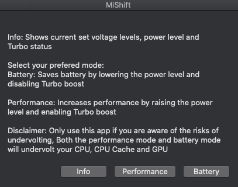

MiVolt - Improve your Mac's battery life

MiVolt uses Voltageshift, but makes it simpler to use by adding a GUI. Additionally some tweaks for hackintosh`s, like safe shutdown when battery is low (instead of crash), automatic powerlevels for AC / BaT and soon many more.

Currently MiVolt will undervolt your CPU, GPU and CPU Cache by a fixed value, but this will be changed soon to a version with user input.

Credit: https://github.com/sicreative/VoltageShift
